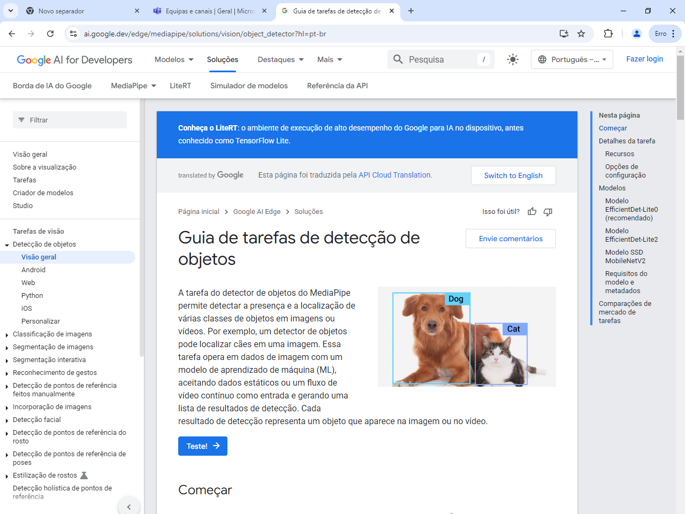

Ir no google e pesquidar MediaPipe para acessar, é um ambiente com modelos de IA treinadas.
Na esquerda, ir em "Detecção de objetos" e depois "Visão Geral", após clicar em "Testar"

Iniciar o Anaconda Navigator e executar o "CMD.exe Promt"

-- pip install opencv-python
-- pip install matplotlib
-- pip install notebook
-- pip install pyserial
-- pip install mediapipe

ou

-- python3 -m pip install opencv-python
-- python3 -m pip install matplotlib
-- python3 -m pip install notebook
-- python3 -m pip install pyserial
-- python3 -m pip install mediapipe

ou

-- brew install opencv-python
-- brew install python-matplotlib
-- brew install notebook
-- brew install --cask serial
-- brew install mediapipe